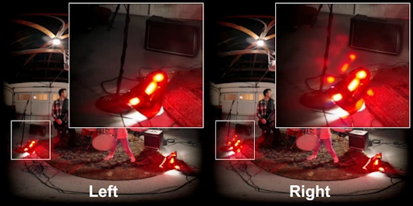
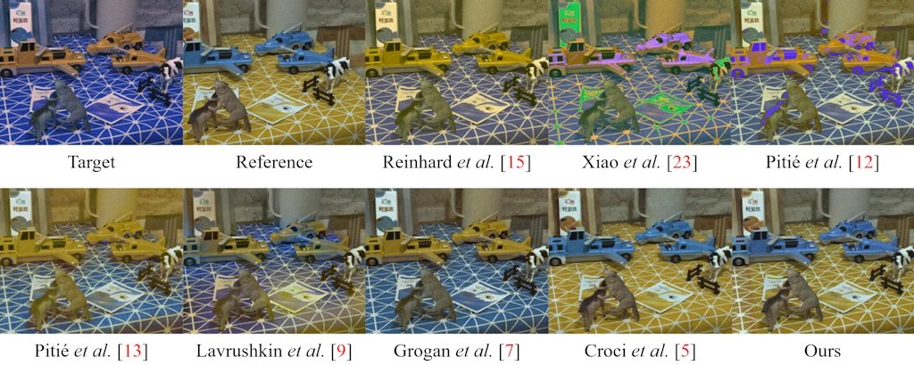
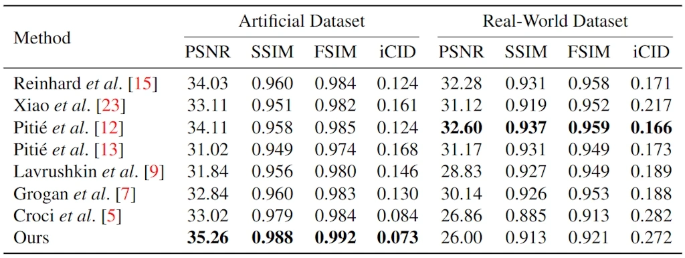

<h1 align="center">Color Mismatches in Stereoscopic Video: Real-World Dataset and Deep Correction Method</h1>

<h3 align="center">
    <a href="https://arxiv.org/abs/2303.06657">Paper</a>
    |
    <a href="https://videoprocessing.ai/datasets/stereo-mismatch.html">Real-World Dataset</a>
    |
    <a href="https://wandb.ai/egorchistov/color-transfer">WandB</a>
    |
    <a href="https://colab.research.google.com/github/egorchistov/color-transfer/blob/master/demo.ipynb">Demo</a>
</h3>

<p align="center"></p>
<p align="center"><i>Frame #1,200 from video “VR180 Cameras with Daydream,” taken by <a href="https://www.youtube.com/watch?v=TH MMXinRsA/">Google</a>, contains color mismatches.</i></p>

Color-mismatch correction is the task of transferring color from one view of a stereopair to the corresponding areas in another where the colors differ incorrectly.

This repo contains **two datasets** and **six** color-transfer **methods**.

## What’s New

* **Soooooon** We will update our paper
* **15.05.2024** We have updated the comparison methodology and improved our color-transfer method
* **15.06.2023** We were not allowed to attend the EUSIPCO 2023 conference because of our affiliation
* **15.06.2023** The arXiv v2 version has been updated with FSIM and iCID results
* **29.05.2023** Our work was accepted for the EUSIPCO 2023 conference
* **12.03.2023** The arXiv v1 version has been published

## Demo

Given an image pair or a video sequence, our code supports generating color-transfer results. Refer to [jupyter notebook](https://colab.research.google.com/github/egorchistov/color-transfer/blob/master/demo.ipynb) for example usages.

<p align="center"></p>
<p align="center"><i>Results of the color transfer from the reference image to the target image on a stereopair from InStereo2K. The hue of the target image was adjusted using the maximum magnitude (+0.5). Neural network-based methods (Croci et al. and ours), that were trained on such distortions, have successfully transferred the colors.</i></p>

## Installation

Clone this repo and install dependencies:

```shell
git clone https://github.com/egorchistov/color-transfer.git
cd color-transfer
pip install -qr requirements.txt
```

## Datasets

We created the following datasets to train and evaluate available models:

* [Artificial Dataset](https://www.kaggle.com/datasets/egorchistov/dcmc-dataset) — 1035 stereopairs
* [Real-World Dataset](https://videoprocessing.ai/datasets/stereo-mismatch.html) — 14 stereo videos

## Training

Download the datasets and use these commands to start training:

```shell
python -m utils.cli fit --config configs/dcmcs3di.yaml
python -m utils.cli fit --config configs/dmsct.yaml
```

Refer to [WandB](http://wandb.ai/egorchistov/color-transfer) for training history and weights of the trained models.

## Evaluation

Download the specified weights and use these commands to start the evaluation:

```shell
python -m utils.cli test --config configs/dcmcs3di.yaml --ckpt_path color-transfer/y1mq1usg/checkpoints/epoch\=96-step\=10185.ckpt --trainer.logger false
python -m utils.cli test --config configs/dmsct.yaml --ckpt_path color-transfer/86n1v9bd/checkpoints/epoch\=72-step\=7665.ckpt --trainer.logger false
python -m utils.cli test --config configs/others.yaml --model.func_spec "methods.linear.color_transfer_between_images"  # and so on
```

## Results

On the artificial dataset, our method was ranked the best by the all quality-assessment
methods. However, on the real-world data, all non-global
methods, which consider the different non-trivial distortion models, performed worse than
the global methods. This discrepancy is likely due to the domain shift between the distortion
model used in methods’ development and the real-world distortion model.

<p align="center"></p>
<p align="center"><i>Comparison of eight color-mismatch-correction methods on two datasets. The best result appears in <b>bold</b>.</i></p>

## Citation

If you find our work useful, please cite the following paper:

```
@article{chistov2023color,
  title={Color Mismatches in Stereoscopic Video: Real-World Dataset and Deep Correction Method},
  author={Chistov, Egor and Alutis, Nikita and Velikanov, Maxim and Vatolin, Dmitriy},
  howpublished={arXiv preprint arXiv:2303.06657},
  year={2023}
}
```

## See Also

* [Real-World Stereo Color and Sharpness Mismatch Dataset](https://videoprocessing.ai/datasets/stereo-mismatch.html)
