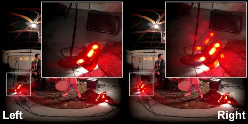
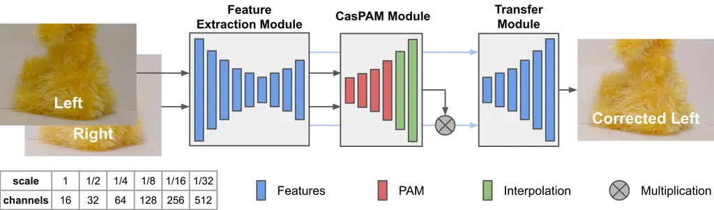
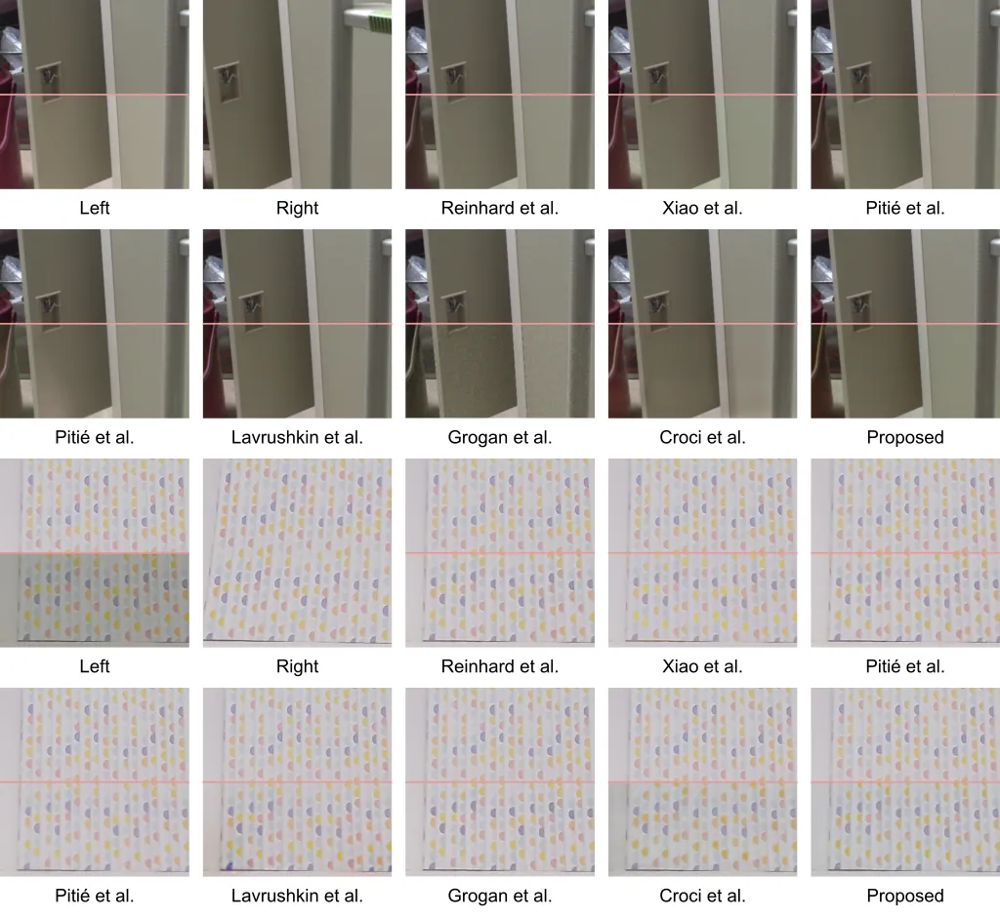
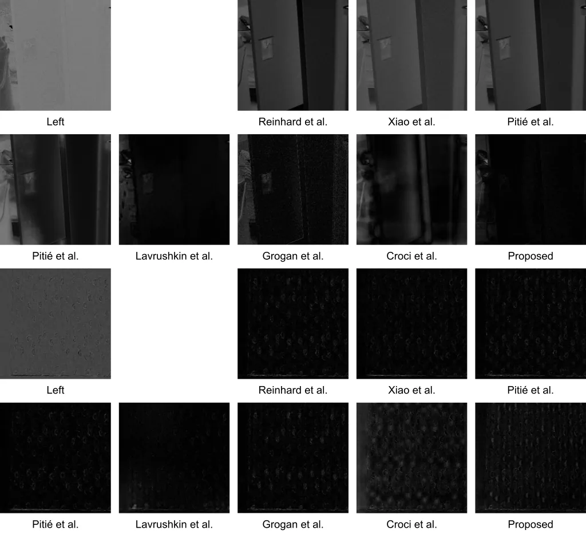

<h1 align="center">Color Mismatches in Stereoscopic Video: Real-World Dataset and Deep Correction Method</h1>

<p align="center">
    <a href="https://github.com/egorchistov">Egor Chistov</a>
    ·
    <a href="https://github.com/illaitar">Nikita Alutis</a>
    ·
    <a href="https://istina.msu.ru/profile/VelikanovMS/">Maxim Velikanov</a>
    ·
    <a href="https://linkedin.com/in/dmitriyvatolin">Dmitriy Vatolin</a>
</p>

<h3 align="center">
    <a href="https://arxiv.org/abs/2303.06657">Paper</a>
    |
    <a href="https://videoprocessing.ai/datasets/stereo-mismatch.html">Real-World Dataset</a>
    |
    <a href="https://wandb.ai/egorchistov/color-transfer">WandB</a>
    |
    <a href="https://colab.research.google.com/drive/1AnKJIJTpTpoWShP_36Jdq4sjMhSyTCMK?usp=sharing">Colab</a>
</h3>

<p align="center"></p>
<p align="center"><i>Frame #1,200 from video “VR180 Cameras with Daydream,” taken by <a href="https://www.youtube.com/watch?v=TH MMXinRsA/">Google</a>, contains color mismatches.</i></p>

<p align="center"></p>
<p align="center"><i>Overview of proposed method for color-mismatch correction. Multiscale features extracted from the stereopair feed into the cascaded parallax-attention mechanism, which performs stereo matching. Matched features passed through the multiscale transfer module to yield the corrected left view.</i></p>

Color-mismatch correction is the task of transferring color from one view of a stereopair to corresponding areas in another where the colors differ incorrectly.

This repo contains **two datasets** and **six** color-mismatch correction **methods**.

## What’s New

* **Sooooooooon** Method upgrade
* **19 Jun 2023** bachelor's thesis version with upgraded method published
* **15 Jun 2023** arXiv v2 version updated with FSIMc and iCID metrics' results
* **12 Mar 2023** arXiv v1 version published

## Installation

Our code is developed based on pytorch 2.0, pytorch-lightning 2.0, and python 3.10. Other versions should also work well. Clone this repo and install dependencies:

```shell
git clone https://github.com/egorchistov/color-transfer.git
cd color-transfer
pip install -qr requirements.txt
```

## Demo

Given an image pair or a video sequence, our code supports generating color correction results. Please refer to [colab](https://colab.research.google.com/drive/1AnKJIJTpTpoWShP_36Jdq4sjMhSyTCMK?usp=sharing) file for example usages.

<p align="center"></p>
<p align="center"><i>Examples of color-mismatch correction. For each example upper part is from ground truth view. The first stereopair is from the artificial dataset; the second is from the real-world dataset.</i></p>

Below you can see normalized absolute difference between ground truth and method result.

<p align="center"></p>
<p align="center"><i>Normalized absolute difference between left ground truth and left corrected view. Right view left unchanged. The first stereopair is from the artificial dataset; the second is from the real-world dataset.</i></p>

## Datasets

We created the following datasets to train and evaluate available models:

* [Artificial Dataset](https://www.kaggle.com/datasets/egorchistov/dcmc-dataset) — 1035 stereopairs
* [Real-World Dataset](https://videoprocessing.ai/datasets/stereo-mismatch.html) — 24 stereo videos

## Training

Use these commands to start training:

```shell
python -m utils.cli fit --config configs/dcmcs3di.yaml
python -m utils.cli fit --config configs/dmsct.yaml
```

Refer to [WandB](http://wandb.ai/egorchistov/color-transfer) for training history of available models.

## Evaluation

Use these commands to start evaluation:

```shell
python -m utils.cli test --config configs/dcmcs3di.yaml --ckpt_path color-transfer/r9bydkqw/checkpoints/epoch\=96-step\=10185.ckpt --trainer.logger false
python -m utils.cli test --config configs/dmsct.yaml --ckpt_path color-transfer/3qowm3x2/checkpoints/epoch\=72-step\=7665.ckpt --trainer.logger false
python -m utils.cli test --config configs/others.yaml --model.func_spec "methods.linear.color_transfer_between_images"
```

## Citation

```
@misc{chistov2023color,
  author={Chistov, Egor and Alutis, Nikita and Velikanov, Maxim and Vatolin, Dmitriy},
  title={Color Mismatches in Stereoscopic Video: Real-World Dataset and Deep Correction Method},
  howpublished={arXiv:2303.06657 [cs.CV]},
  year={2023}
}
```

## Acknowledgements

This project would not have been possible without relying on some awesome repos: [ptallada](https://github.com/ptallada/colour_transfer), [pengbo-learn](https://github.com/pengbo-learn/python-color-transfer), and [PAM](https://github.com/The-Learning-And-Vision-Atelier-LAVA/PAM). We thank the original authors for their excellent work.

## See Also

* [Real-World Stereo Color and Sharpness Mismatch Dataset](https://videoprocessing.ai/datasets/stereo-mismatch.html)
